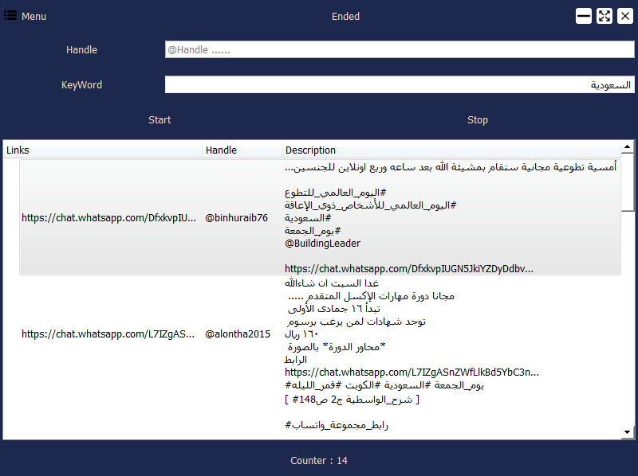
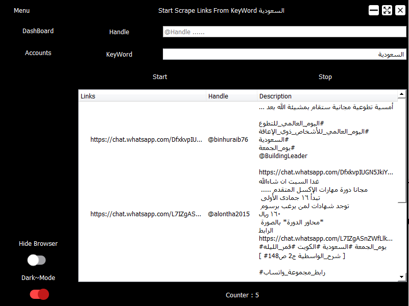

# Twitter_Adv_Search
Advanced Automatic search in Twitter 
searching for Links in tweets 
1- Whatsapp Links
2- Telegram Links (Under adding)

## App Images
 

 

## Pages

* DashBoard --> To Scrape WhatsApp links From Twitter Handle Or KeyWord 
* Accounts --> To Handling Accounts (Under Updating)

## Features

1- DarkMode (Switching Between Light and dark Modes)
2- Scrape without openning Browser (HideBrowser) 
3- High Performance && Fast Results

## Built With

* Python
* Selenium 

## Frameworks 

* [PyQt5](https://doc.qt.io/qtforpython/)   For Build GUI 
* [Selenium](https://www.selenium.dev/)     For WebAutomation

## Made By K7 Hesham